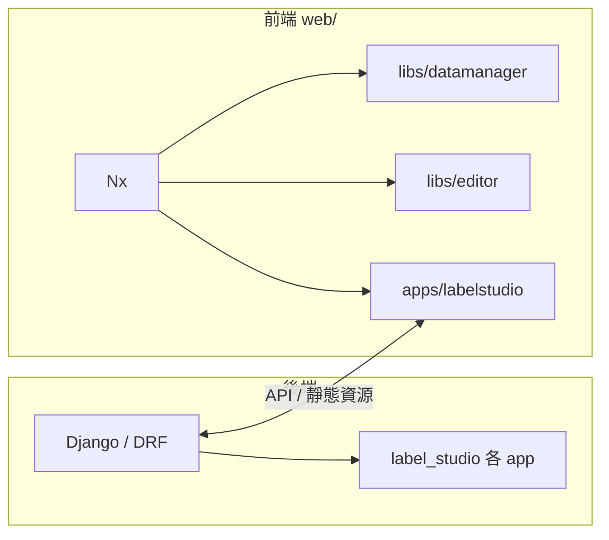

# AGENTS.md — Label Studio 儲存庫代理指引

本檔遵循 **harness engineering** 精神：給自動化代理一份**可執行、可導航**的專案地圖，而非重複 README 全文。細節請以程式碼與連結文件為準。

---

## 專案是什麼

- **Label Studio**：開源資料標註平台；後端 **Django + DRF**，前端 **Nx 單體倉庫（React 為主）**。
- **後端原始碼來源（本儲存庫）**：目錄 **`label_studio/`** 是你（本 fork）維護與修改的程式，**不是**從 PyPI `pip install label-studio` 拉下來的別人發布物當作應用主體。本機 `poetry install` 與根目錄 **`Dockerfile` 的 `docker build`** 都會把**目前工作樹裡的** `label_studio/` 與 `web/` 打進環境／映像；因此映像內容反映**你的修改**。`pyproject.toml` 裡另可能有指向 GitHub 的 **SDK** 等依賴，與「應用本體在這個 repo」是兩件事。
- **執行模型**：Django 提供頁面與 API，並服務建置後的前端靜態資源（例如 `/react-app/`）；開發時可搭配 **HMR** 由獨立 dev server 提供前端。

---

## 架構一覽（精簡）



- **後端根目錄**：`label_studio/`（`manage.py` 在此）。
- **API 匯流**：`label_studio/core/urls.py` 透過 `include()` 掛載各 app 的 `urls`。
- **前端根目錄**：`web/`（**Nx** 設定於 `web/nx.json`；依賴與 script 在 `web/package.json`）。

---

## 目錄地圖（代理常改動處）

| 區域 | 路徑 | 說明 |
|------|------|------|
| Django 設定 | `label_studio/core/settings/` | 環境與靜態路徑等 |
| 業務 app | `label_studio/projects/`, `tasks/`, `data_manager/`, `ml/`, `io_storages/`, … | 模型、API、遷移依 app 分區 |
| 主要 React 應用 | `web/apps/labelstudio/` | 頁面、路由、providers；例如 `src/pages/` |
| 標註編輯器函式庫 | `web/libs/editor/` | MobX State Tree 等標註核心 |
| 資料管理 UI 函式庫 | `web/libs/datamanager/` | 資料探索相關 |
| 共用 UI / 核心 | `web/libs/ui/`, `web/libs/core/` | 設計系統與共用工具 |
| 獨立 Playground | `web/apps/playground/` | 標註設定預覽（Jotai + editor） |
| 代理規則補件 | `.cursor/rules/*.mdc` | 與本檔互補的專題規範 |

**本 fork 範例**：模型部署相關後端多在 `label_studio/ml/`（如 `ModelDeployment`），前端頁面在 `web/apps/labelstudio/src/pages/ModelDeployment/`。

---

## 環境先決條件

- **Python**：`>=3.10,<4`（見根目錄 `pyproject.toml`）。
- **依賴管理**：根目錄使用 **Poetry**（`poetry install`；測試可加 `poetry install --with test`）。
- **前端**：Node + **Yarn**，在 `web/` 執行 `yarn install --frozen-lockfile`。
- **Windows**：建議使用專案根目錄的 **PowerShell 啟動腳本**（見下節）；Make 目標多為 Unix shell。
- **RQ / 本機訓練相關**：需 **Docker Desktop**（供 `start-redis.ps1` 跑 Redis）與可執行的 **Poetry**（`start-rqworker.ps1`、`start-dev.ps1`）。

---

## Windows 本機開發（PowerShell，專案根目錄）

完整啟動步驟、Docker 部署與疑難排解見 **`測試以及部署.md`**。

本 fork 以多支腳本啟動（**順序**如下）。腳本內容為單一真相來源：`start-redis.ps1`、`start-rqworker.ps1`、`start-dev.ps1`、`start-triton.ps1`、`start-all.ps1`。

### 一般 UI／API 開發

```powershell
.\start-dev.ps1
# 或一鍵：.\start-all.ps1
```

- 會另開視窗：後端 **Django**（`localhost:8080`，SQLite + `FRONTEND_HMR=true`）與 **前端 HMR**（`yarn dev:win`，預設 **8010**）。
- 瀏覽器開發網址（腳本提示）：**http://localhost:8010**
- 前置：`poetry install`；`web/` 內已 `yarn install`。

### 需要背景佇列（例如 Training／YOLO 本機訓練 enqueue）

先 Redis、再 RQ worker、最後再開發主流程：

```powershell
.\start-redis.ps1      # Docker：容器 ls-redis，埠 6379
.\start-rqworker.ps1   # queue `low`，Windows 使用 SimpleWorker（避免 os.fork）
.\start-dev.ps1
# 或：.\start-all.ps1 -WithQueue
```

- 若未啟 Redis／worker，在 Windows 上跑預設 fork worker 可能出現 **`os` 無 `fork`** 等錯誤；請依 `start-rqworker.ps1` 註解使用 **Poetry** 的 Python，避免與系統 Anaconda 的 NumPy／SciPy ABI 衝突。

---

## 常用指令（代理應優先使用）

**後端（專案根目錄）**

```bash
poetry install
poetry run python label_studio/manage.py migrate
poetry run python label_studio/manage.py runserver
```

與 SQLite 開發相關的變體可參考 `Makefile`（`run-dev`、`migrate-dev`、`makemigrations-dev` 等環境變數：`DJANGO_DB=sqlite`、`DJANGO_SETTINGS_MODULE=core.settings.label_studio`）。

**後端測試（範例）**

```bash
cd label_studio
DJANGO_DB=sqlite DJANGO_SETTINGS_MODULE=core.settings.label_studio pytest -vv
# 或專案根目錄：make test
```

**前端（`web/` 目錄）**

```bash
yarn install --frozen-lockfile
yarn dev              # 主應用 HMR（Unix 風格環境變數）
yarn dev:win          # Windows 友善
yarn build            # 生產建置
yarn test:unit        # 單元測試（Nx run-many）
yarn ls:e2e           # labelstudio e2e（Cypress）
```

**格式化／檢查**：根目錄 `make fmt` / `make fmt-check`（pre-commit）；前端 `yarn lint`（Biome）。

---

## 實作慣例（與本倉一致）

- **後端**：Django 慣例；API 多為 DRF；非同步遷移與 queryset 效能請遵守 `.cursor/rules/async_migrations.mdc`、`.cursor/rules/iterate_queryset.md`。
- **前端**：主應用以 React 為主；目錄與元件風格見 `.cursor/rules/react.mdc`、`.cursor/rules/typescript.mdc`、`.cursor/rules/tailwind.mdc`。
- **新增儲存後端／連接器**：讀取並遵循 `.cursor/rules/storage-provider.mdc`。
- **Cypress**：`.cursor/rules/cypress_tests.mdc`。

新增程式碼時，註解風格請與周邊檔案一致；若專案約定使用 **JSDoc**，請用於需說明契約的匯出 API（函式、複雜 props），避免對顯而易見的程式碼過度註解。

---

## 延伸閱讀（人類與代理共用）

- **本機測試與 Docker 部署**：`測試以及部署.md`
- 前端安裝與 HMR：`web/README.md`
- 使用者與部署面向：`README.md`、`docs/source/guide/`
- Playground 架構摘要：`web/apps/playground/README.mdc`

---

## 常見陷阱（Gotchas）

- **Windows**：本機完整開發流程以 `start-*.ps1` 為準；RQ 相關務必 **SimpleWorker** + 先起 **Redis**（見 `start-rqworker.ps1`）。
- 改動 **Django model** 後需遷移；合併前留意 migration linter 與團隊對 **sqlite / postgres** 的測試習慣。
- 前端 **路徑別名與 Nx boundary** 以現有 `import` 為準，不要憑空新增跨 lib 依賴。
- 僅修改本任務相關檔案；大範圍「順便重構」容易引入無關 diff。

---

## 提交與協作（精簡）

- 維持 **小而可審閱** 的變更；提交訊息與 PR 說明應清楚描述**行為變更與動機**。
- 若 CI 涵蓋單元／e2e，於合理範圍內跑過與變更相關的測試再提交。
