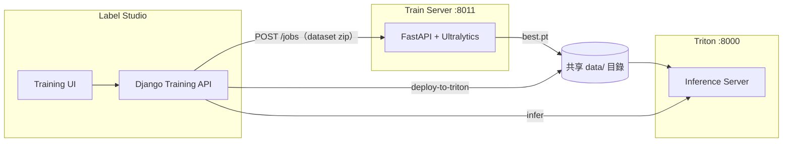

# Train Server 獨立訓練服務 — 架構、部署與測試

本指南說明 **Label Studio Train Server** 的定位、與 **Triton Inference Server** 及 **本機 RQ 訓練** 的差異，以及如何部署、連線與驗證。

---

## 一、架構概覽

### 1.1 三種訓練／推論模式對照

| 維度 | 本機 RQ 訓練（內建） | **Train Server**（獨立） | **Triton Server**（推論） |
|------|---------------------|--------------------------|---------------------------|
| **職責** | 在 Label Studio 進程內排隊訓練 | 專用 YOLO 訓練微服務 | 模型推論（inference） |
| **部署** | 與 Django 同機，需 Redis + RQ worker | 獨立容器／主機（`:8011`） | 獨立容器（`:8000` HTTP） |
| **連線方式** | 無外部 URL，走 Redis queue | REST API（`TRAIN_SERVER_URL`） | REST/gRPC（`TRITON_SERVER_URL`） |
| **依賴** | torch / ultralytics 裝在 Label Studio venv | 獨立 venv 或 `Dockerfile.train-server` | NVIDIA Triton 映像 |
| **典型硬體** | 與 Web 搶 CPU/GPU | 可部署到 GPU 訓練節點 | GPU 推論節點 |
| **產物** | `data/training/models/trained/` | 同路徑（共享 volume 時） | `data/triton_models/`（ONNX） |
| **UI 設定** | 預設（不需額外 URL） | Training 頁面填 Train Server URL | Model Deployment 填 Triton URL |

### 1.2 端到端流程



1. 使用者在 Label Studio **準備資料集** → 建立訓練任務。
2. 若設定 `TRAIN_SERVER_URL`，Django **轉發**任務至 Train Server（非 RQ）。
3. Train Server 執行 YOLO 訓練，產出 `best.pt`。
4. （選用）呼叫 **部署至 Triton** API，將 `best.pt` 匯出 ONNX 至 Triton 模型目錄。
5. Triton 載入模型，對外提供推論 API。

### 1.3 何時使用 Train Server

**建議使用 Train Server：**

- 訓練需要 **GPU**，但 Label Studio Web 節點僅 CPU。
- 希望 **隔離** torch / ultralytics 依賴（避免與 Django venv 衝突）。
- 多台 Label Studio 共用 **同一訓練叢集**。
- Windows 本機開發時，避免 RQ SimpleWorker 與 Anaconda NumPy ABI 問題。

**仍用本機 RQ：**

- 僅需輕量測試、無 GPU 節點。
- **CNN classify** 任務（目前僅支援本機 RQ，不轉發 Train Server）。

**Triton 與 Train Server 互補：**

- Train Server = **訓練**；Triton = **推論**。兩者皆透過 HTTP API 連線，但埠號、協定與用途不同。

---

## 二、部署 Train Server

### 2.1 Docker Compose（建議，與 Label Studio 同 stack）

專案根目錄 `docker-compose.yml` 已含 `train-server` 服務：

```powershell
# 僅啟動 Train Server
docker compose up -d train-server

# 完整 stack（含 app、rqworker、triton、train-server）
docker compose up --build -d
```

**服務間連線（容器內）：**

```env
TRAIN_SERVER_URL=http://train-server:8011
TRAIN_SERVER_API_KEY=your-secret   # 可選，兩端需一致
```

**對外埠：** 主機 `http://localhost:8011`

**共享資料目錄：**

| 容器 | 掛載 | 用途 |
|------|------|------|
| `app` / `rqworker` | `./data` → `/label-studio/data` | 資料集、訓練產物 |
| `train-server` | `./data` → `/data` | 預訓練權重、訓練輸出 |

若兩者掛載同一 `./data`，可在建立 job 時傳 `dataset_path` 略過 zip 上傳（見 §4.3）。

**GPU（選用）：** 編輯 `docker-compose.yml` 中 `train-server` 的 `deploy.resources.reservations.devices` 區塊，並安裝 [NVIDIA Container Toolkit](https://docs.nvidia.com/datacenter/cloud-native/container-toolkit/install-guide.html)。

### 2.2 獨立 Docker 映像（遠端訓練節點）

在 **不含 Label Studio** 的 GPU 機器上：

```bash
git clone <your-repo> && cd label-studio

docker build -f Dockerfile.train-server -t labelstudio-train-server:latest .

docker run -d --name train-server \
  -p 8011:8011 \
  -v /path/to/shared-data:/data \
  -e TRAIN_SERVER_API_KEY=your-secret \
  -e TRAIN_SERVER_MAX_WORKERS=2 \
  labelstudio-train-server:latest
```

Label Studio 端設定：

```env
TRAIN_SERVER_URL=http://<gpu-host-ip>:8011
TRAIN_SERVER_API_KEY=your-secret
```

### 2.3 Windows 本機開發

Train Server 使用 **獨立虛擬環境** `.venv-train`（與 Label Studio `.venv` 分離）：

```powershell
# 首次（約數分鐘，安裝 PyTorch CPU）
.\scripts\setup-venv-train.ps1

# 啟動 Train Server（預設 http://localhost:8011）
.\start-train-server.ps1
```

Label Studio 開發環境（`.env` 或 `start-dev.ps1` 自動帶入）：

```env
TRAIN_SERVER_URL=http://localhost:8011
```

一鍵含 Train Server：

```powershell
.\start-all.ps1 -WithQueue -WithTrainServer
```

### 2.4 環境變數

| 變數 | 預設 | 說明 |
|------|------|------|
| `TRAIN_SERVER_HOST` | `0.0.0.0` | 監聽位址 |
| `TRAIN_SERVER_PORT` | `8011` | 監聽埠 |
| `TRAIN_SERVER_OUTPUT_ROOT` | `/data/training/models/trained` | 訓練產物根目錄 |
| `TRAIN_SERVER_MODELS_DIR` | `/data/training/models/original` | 預訓練權重快取 |
| `TRAIN_SERVER_MAX_WORKERS` | `1` | 同時訓練任務數 |
| `TRAIN_SERVER_API_KEY` | （空） | API 金鑰；設定後請求需 `X-API-Key` header |
| `TRAIN_SERVER_TIMEOUT` | `120` | Label Studio 端 HTTP 逾時（秒） |

**Label Studio 端：**

| 變數 | 說明 |
|------|------|
| `TRAIN_SERVER_URL` | Train Server 基底 URL；**未設定則 YOLO 任務走本機 RQ** |
| `TRAIN_SERVER_API_KEY` | 與 Train Server 端一致（可選） |

---

## 三、使用方式

### 3.1 UI 操作

1. 開啟專案 → **Training** 頁面。
2. 在 **Train Server** 區塊填寫 URL（例如 `http://192.168.1.10:8011`）與 API Key（若有）。
3. 點 **驗證連線** → 應顯示 `ok: true`。
4. 選擇 YOLO 任務、基礎權重、訓練參數 → **開始訓練**。
5. 在 **Training Progress** 查看遠端 job 狀態與預覽圖。

> UI 設定存於瀏覽器 `localStorage`（每專案）；優先於伺服器環境變數。

### 3.2 Label Studio 代理 API

以下端點由 Django 轉發至 Train Server（需 `Authorization: Token <token>`）：

| 方法 | 路徑 | 說明 |
|------|------|------|
| GET | `/api/projects/<id>/training/train-server/health/` | 驗證連線 |
| GET | `/api/projects/<id>/training/models/?train_server_url=...` | 遠端模型清單 |
| POST | `/api/projects/<id>/training/jobs/` | 建立訓練（body 可含 `train_server_url`） |
| GET | `/api/projects/<id>/training/jobs/<job_id>/` | 任務狀態 |
| GET | `/api/projects/<id>/training/jobs/<job_id>/progress/` | 訓練進度 |
| GET | `/api/projects/<id>/training/jobs/<job_id>/artifacts/` | 產物清單 |
| GET | `/api/projects/<id>/training/jobs/<job_id>/download?file=best.pt` | 下載權重 |

**建立訓練任務範例：**

```bash
curl -X POST "http://localhost:8080/api/projects/1/training/jobs/" \
  -H "Authorization: Token YOUR_TOKEN" \
  -H "Content-Type: application/json" \
  -d '{
    "base_weights": "yolo11n.pt",
    "dataset_config": "/label-studio/data/training/datasets/project_1/dataset.yaml",
    "epochs": 50,
    "imgsz": 640,
    "batch": 16,
    "train_server_url": "http://train-server:8011",
    "train_server_api_key": "your-secret"
  }'
```

成功回應含 `"train_server": "remote"` 與 `job_id`。

### 3.3 Train Server 原生 API

直接呼叫 Train Server（繞過 Django）：

| 方法 | 路徑 | 說明 |
|------|------|------|
| GET | `/health` | 健康檢查 |
| GET | `/tasks` | 各 YOLO 任務預設參數 |
| GET | `/models?task=detect` | 模型目錄 |
| POST | `/models/ensure` | 確保權重存在（自動下載） |
| POST | `/jobs` | 建立訓練（multipart：dataset_zip + 表單） |
| GET | `/jobs/{id}` | 任務狀態 |
| GET | `/jobs/{id}/progress` | 訓練進度 |
| GET | `/jobs/{id}/artifacts` | 產物清單 |
| GET | `/jobs/{id}/download?file=best.pt` | 下載權重 |
| GET | `/jobs/{id}/preview?file=...` | 訓練曲線／混淆矩陣預覽圖 |
| GET | `/projects/{id}/runs` | 專案訓練紀錄 |

若設定 `TRAIN_SERVER_API_KEY`，請求需帶 header：`X-API-Key: <key>`。

**健康檢查：**

```bash
curl http://localhost:8011/health
# {"status":"ok","service":"train-server"}
```

### 3.4 共享資料集路徑（略過 zip 上傳）

當 Label Studio 與 Train Server 掛載 **同一 `data/` 目錄** 時，可在建立 job 時指定容器內路徑：

```json
{
  "dataset_path": "/data/training/datasets/project_1",
  "dataset_config": "/label-studio/data/training/datasets/project_1/dataset.yaml",
  "base_weights": "yolo11n.pt"
}
```

- Label Studio 容器路徑：`/label-studio/data/...`
- Train Server 容器路徑：`/data/...`（同一 host 目錄 `./data`）

---

## 四、測試與驗證

### 4.1 快速健康檢查

**Train Server 直接：**

```powershell
curl http://localhost:8011/health
curl http://localhost:8011/tasks
curl "http://localhost:8011/models?task=detect"
```

**經 Label Studio 代理（需 Token）：**

```powershell
curl "http://localhost:8080/api/projects/1/training/train-server/health/?train_server_url=http://localhost:8011" `
  -H "Authorization: Token YOUR_TOKEN"
```

預期：`{"ok": true, "base_url": "http://localhost:8011", "status": "ok", "service": "train-server"}`

### 4.2 Docker Compose 整合測試清單

| # | 步驟 | 預期結果 |
|---|------|----------|
| 1 | `docker compose up -d train-server` | 容器 `healthy`，`:8011` 可連 |
| 2 | `curl localhost:8011/health` | `status: ok` |
| 3 | 設定 app 的 `TRAIN_SERVER_URL=http://train-server:8011` | compose 已預設 |
| 4 | UI → Training → 驗證連線 | `ok: true` |
| 5 | 準備資料集 → 開始訓練 | 回應含 `"train_server": "remote"` |
| 6 | Training Progress 輪詢 | status 由 `queued` → `running` → `completed` |
| 7 | 下載 `best.pt` | 檔案存在且大小 > 0 |
| 8 | （選用）deploy-to-triton → Triton infer | 見 `triton_deploy.md` |

### 4.3 本機 Windows 測試流程

```powershell
# 終端 1：Train Server
.\start-train-server.ps1

# 終端 2：Label Studio 開發
$env:TRAIN_SERVER_URL = "http://localhost:8011"
.\start-dev.ps1

# 或一鍵
.\start-all.ps1 -WithTrainServer
```

驗證腳本（PowerShell）：

```powershell
# scripts/test-train-server-health.ps1 等效指令
$base = "http://localhost:8011"
Invoke-RestMethod "$base/health"
Invoke-RestMethod "$base/tasks"
(Invoke-RestMethod "$base/models?task=detect").models.Count
```

### 4.4 API 金鑰測試

```powershell
# Train Server 端
$env:TRAIN_SERVER_API_KEY = "test-secret"

# 無 key → 401
curl http://localhost:8011/tasks

# 有 key → 200
curl -H "X-API-Key: test-secret" http://localhost:8011/tasks
```

Label Studio 端同步設定 `TRAIN_SERVER_API_KEY=test-secret`，或在 UI 填相同 API Key。

### 4.5 最小煙霧測試（smoke test）

使用極少 epoch 驗證端到端：

1. 在專案匯入少量已標註圖片（≥2 張）。
2. Training → Prepare Dataset。
3. 選 `yolo11n.pt`，`epochs: 1`，`batch: 2`。
4. 確認 Train Server URL 已設定 → Start Training。
5. 約 1–5 分鐘後 job 應 `completed`，artifacts 含 `best.pt`。

### 4.6 常見問題

| 現象 | 可能原因 | 處理 |
|------|----------|------|
| UI 顯示「未設定 Train Server」 | 無 `TRAIN_SERVER_URL` 且 UI 未填 URL | 設定 env 或 UI 填 `http://host:8011` |
| 驗證連線失敗 | 防火牆、埠未開、容器未起 | `curl http://host:8011/health` |
| 401 Invalid API key | 兩端 key 不一致 | 核對 `TRAIN_SERVER_API_KEY` |
| 503 Failed to submit job | 資料集 zip 過大、逾時 | 改用共享 `dataset_path` 或調高 `TRAIN_SERVER_TIMEOUT` |
| 訓練仍走 RQ | URL 未生效或 CNN 任務 | 確認回應含 `"train_server": "remote"`；CNN 僅本機 |
| 模型清單為空 | 遠端尚未下載權重 | 呼叫 `/models/ensure` 或首次訓練會自動下載 |
| Windows torch 載入失敗 | Anaconda 衝突 | 使用 `.venv-train`：`.\scripts\install-torch-cpu-windows.ps1` |

---

## 五、與 Triton 串接（訓練 → 推論）

Train Server 產出 `best.pt` 後，可沿用既有 Triton 流程：

1. 訓練完成，取得 `run_id` / `job_id`。
2. 呼叫 `POST /api/projects/<id>/training/runs/<run_id>/deploy-to-triton`。
3. 重啟或輪詢 Triton 載入 ONNX 模型。
4. 透過 Triton HTTP API 或 Label Studio Model Deployment 推論。

詳見：[triton_deploy.md](./triton_deploy.md)

---

## 六、目錄結構

```
label-studio/
├── train_server/              # Train Server 原始碼（FastAPI）
│   ├── main.py                # API 入口
│   ├── job_manager.py         # 任務佇列與狀態
│   ├── trainer.py             # Ultralytics 訓練邏輯
│   └── requirements-train.txt
├── Dockerfile.train-server      # 獨立映像
├── start-train-server.ps1       # Windows 本機啟動
├── label_studio/training/
│   ├── train_client.py        # Label Studio → Train Server HTTP 客戶端
│   └── api.py                 # 代理 API（remote / local 分流）
└── data/
    └── training/
        ├── models/
        │   ├── original/      # 預訓練 .pt
        │   └── trained/       # 訓練產物
        └── datasets/          # 匯出資料集
```

---

## 七、總結

| 步驟 | 說明 |
|------|------|
| 1. 部署 Train Server | Docker Compose、獨立映像或 `start-train-server.ps1` |
| 2. 設定連線 | `TRAIN_SERVER_URL` + 可選 `TRAIN_SERVER_API_KEY` |
| 3. 驗證 | `/health` 或 UI「驗證連線」 |
| 4. 訓練 | UI 或 `POST .../training/jobs/`，回應 `"train_server": "remote"` |
| 5. 推論（選用） | deploy-to-triton → Triton infer |

Train Server 與 Triton 同為 **獨立微服務 + HTTP API**，但分工不同：**Train Server 負責訓練，Triton 負責推論**；Label Studio 作為編排與 UI 入口，無需在主進程安裝完整 torch 堆疊即可使用遠端 GPU 訓練。